# **‫‪Web‬‬ ‫&‬ ‫‪HTTP‬‬**

Team Members
- Mohammad Amin Haji Khodaverdian
- Mohammad Ali Ahmadi Zareh
- Hamed Rastaghi
- Amirhosein Javadi

# **‫‪HTTP headers**
HTTP headers let the client and the server pass additional information with an HTTP request or response.

An HTTP header consists of its case-insensitive name followed by a colon (:), then by its value. Whitespace before the value is ignored.

Headers can be grouped according to their contexts:
1. Request headers contain more information about the resource to be fetched, or about the client requesting the resource.
2. Response headers hold additional information about the response, like its location or about the server providing it.
3. Representation headers contain information about the body of the resource, like its MIME type, or encoding/compression applied.
4. Payload headers contain representation-independent information about payload data, including content length and the encoding used for transport.

Headers can also be grouped according to how proxies handle them:
1. Connection
2. Keep-Alive
3. Proxy-Authenticate
4. Proxy-Authorization
5. TE
6. Trailer
7. Transfer-Encoding
8. Upgrade (see also Protocol upgrade mechanism).

# **HTTP status codes**
HTTP response status codes indicate whether a specific HTTP request has been successfully completed. Responses are grouped in five classes:

1. Informational responses (100–199)
2. Successful responses (200–299)
3. Redirection messages (300–399)
4. Client error responses (400–499)
5. Server error responses (500–599)

**Information responses:**
- 100 Continue
- 101 Switching Protocols
- 102 Processing (WebDAV)
- 103 Early Hints

**Successful responses:**
- 200 OK
- 201 Created
- 202 Accepted
- 203 Non-Authoritative Information
- 204 No Content
- 205 Reset Content
- 206 Partial Content
- 207 Multi-Status (WebDAV)
- 208 Already Reported (WebDAV)
- 226 IM Used (HTTP Delta encoding)

**Redirection messages:**
- 300 Multiple Choice
- 301 Moved Permanently
- 302 Found
- 303 See Other
- 304 Not Modified
- 305 Use Proxy 
- 306 unused
- 307 Temporary Redirect
- 308 Permanent Redirect

**Client error responses:**
- 400 Bad Request
- 401 Unauthorized
- 402 Payment Required 
- 403 Forbidden
- 404 Not Found
- 405 Method Not Allowed
- 406 Not Acceptable
- 407 Proxy Authentication Required
- 408 Request Timeout
- 409 Conflict
- 410 Gone
- 411 Length Required
- 412 Precondition Failed
- 413 Payload Too Large
- 414 URI Too Long
- 415 Unsupported Media Type
- 416 Range Not Satisfiable
- 417 Expectation Failed
- 418 I'm a teapot
- 421 Misdirected Request
- 422 Unprocessable Entity (WebDAV)
- 423 Locked (WebDAV)
- 424 Failed Dependency (WebDAV)
- 425 Too Early 
- 426 Upgrade Required
- 428 Precondition Required
- 429 Too Many Requests
- 431 Request Header Fields Too Large
- 451 Unavailable For Legal Reasons
- 500 Internal Server Error
- 501 Not Implemented
- 502 Bad Gateway
- 503 Service Unavailable
- 504 Gateway Timeout
- 505 HTTP Version Not Supported
- 506 Variant Also Negotiates
- 507 Insufficient Storage (WebDAV)
- 508 Loop Detected (WebDAV)
- 510 Not Extended
- 508 Loop Detected (WebDAV)
- 507 Insufficient Storage (WebDAV)

# **‫‪Inspect‬‬**
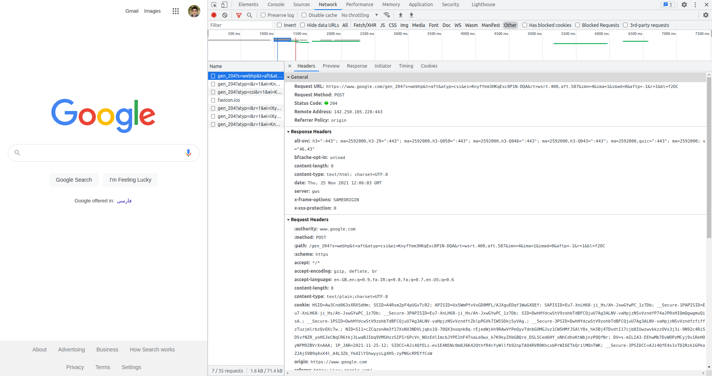

status code:204 (No Content)

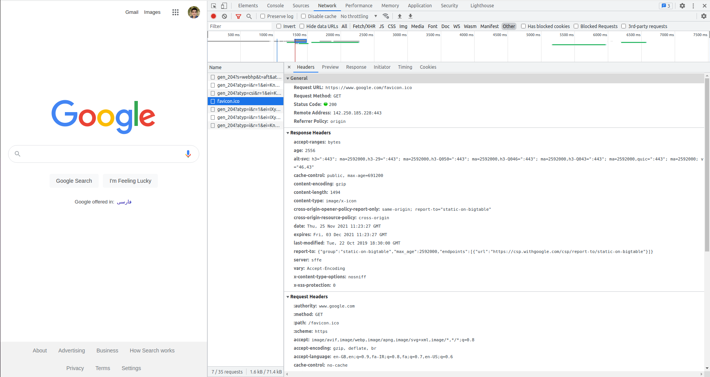

status code:200 (ok)

# **‫‪‫‪Postman‬‬‬‬**

Postman:

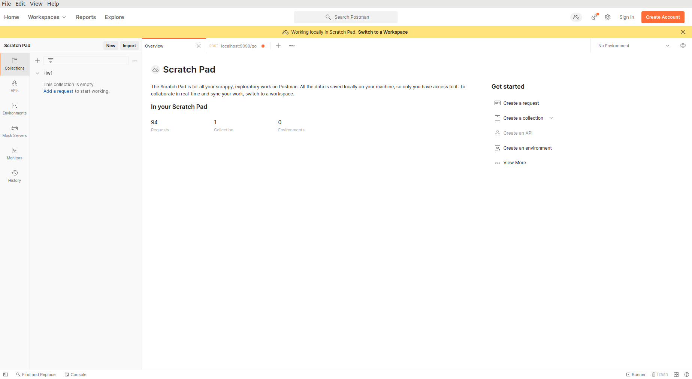

Importing:

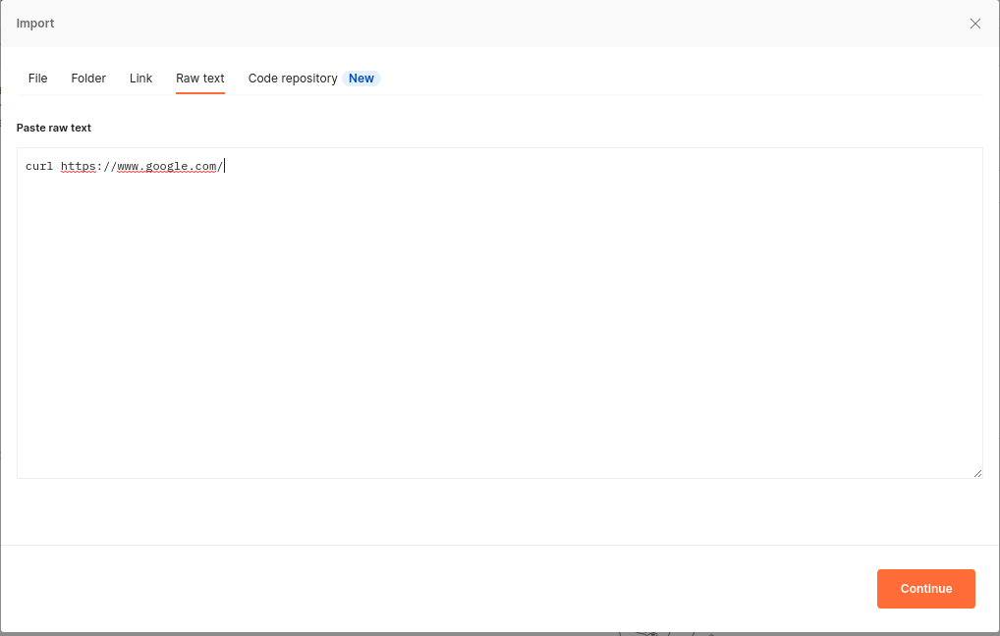

Get method:

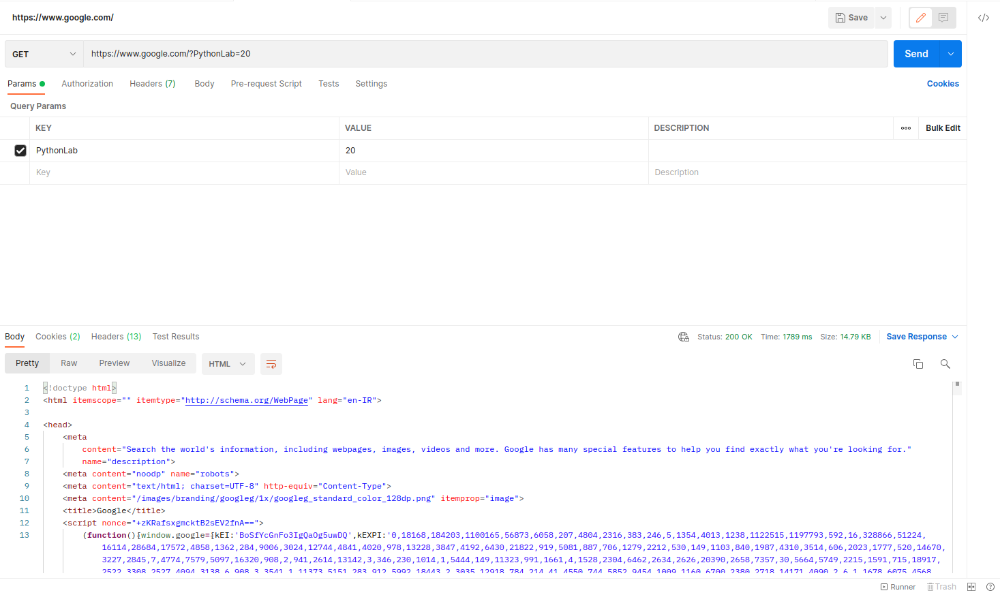

Post method:

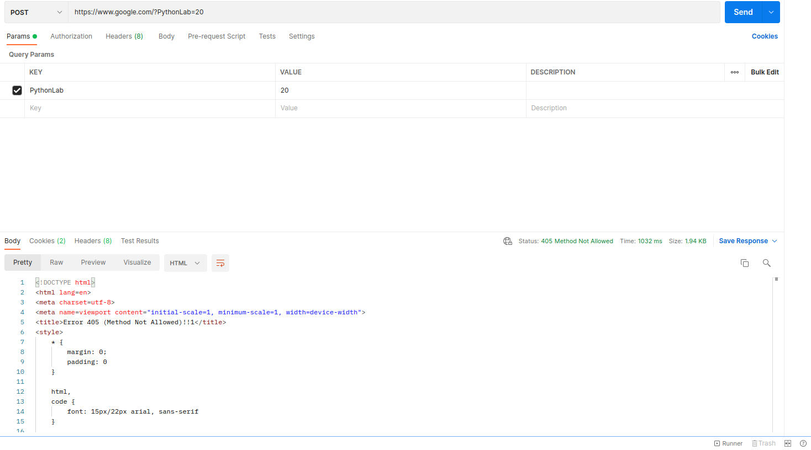

# **jsonplaceholder**
\post:

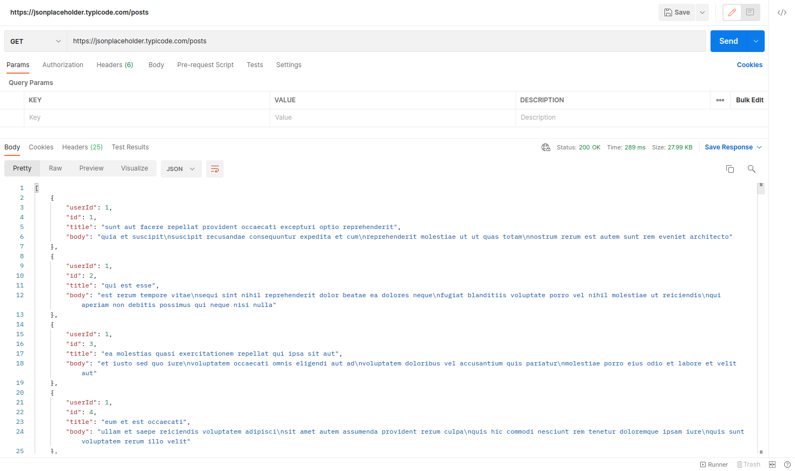

special post:

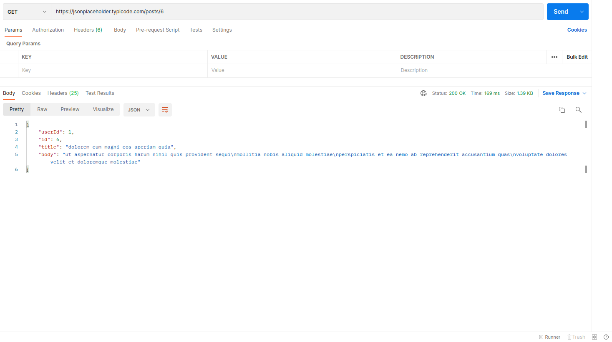

new post:

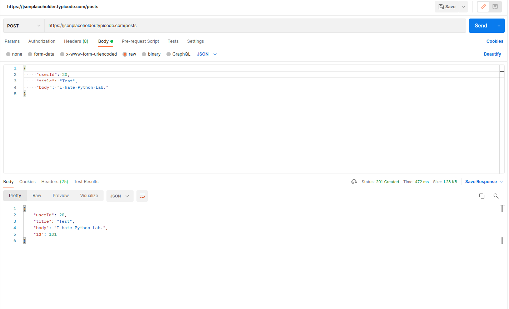

Patch:

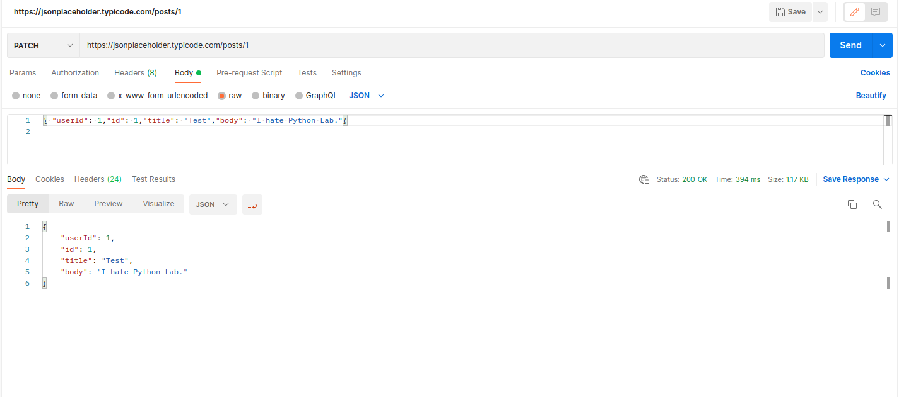

filter post:

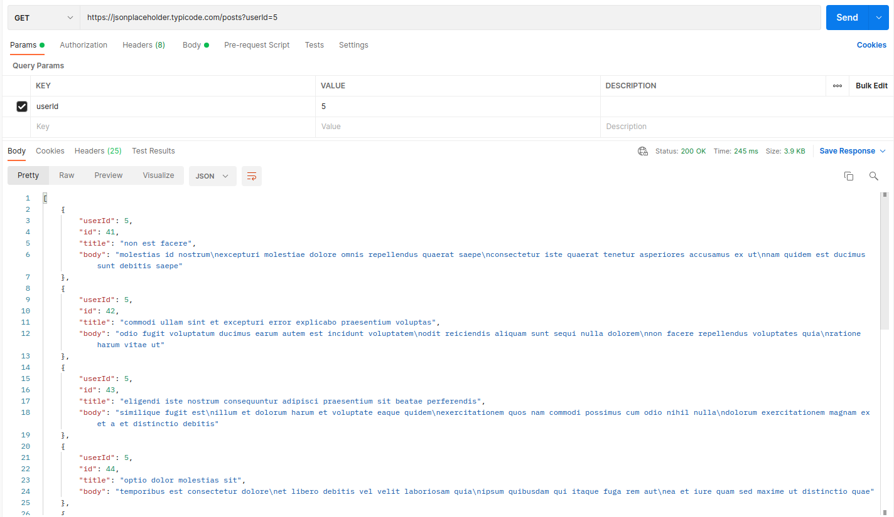
